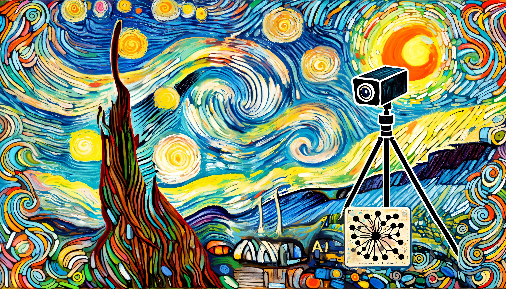
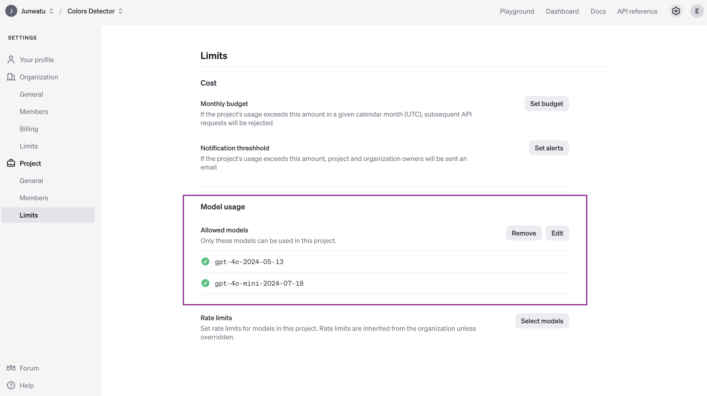
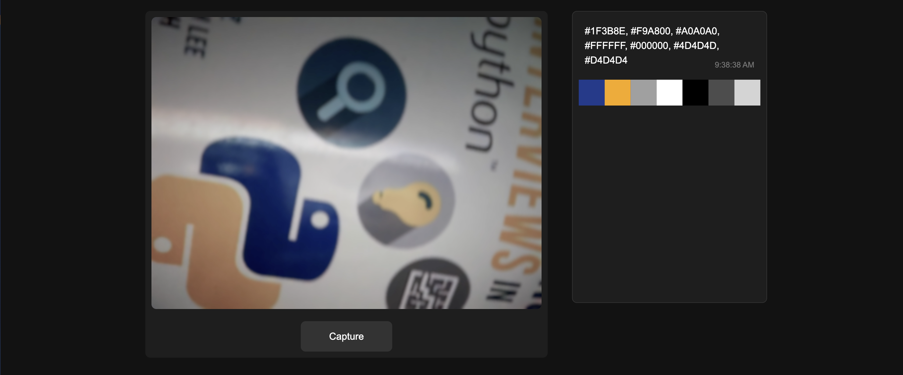

# Color Palettes Extraction Using Webcam and AI



## Table of Contents

 1. [Introduction](#introduction)
 2. [Prerequisites](#prerequisites)
 3. [Running The Project](#running-the-project)
 4. [Setting Up the Environment](#setting-up-the-environment)
 5. [Capturing Images with Node.js](#capturing-images-with-nodejs)
 6. [Processing Images with OpenAI](#processing-images-with-openai)
 7. [Storing Data in GridDB](#storing-data-in-griddb)
 8. [Integrating the Workflow](#building-color-palettes-ui)
 9. [Further Enhancements](#further-enhancements)

## Introduction

In this tutorial, we will explore how to extract color palettes from images captured via a webcam using Node.js, GridDB, and OpenAI. By leveraging Node.js for server-side scripting, GridDB for efficient data storage, and OpenAI for advanced image processing, we will create a seamless pipeline to capture images, analyze them, and generate dynamic color palettes. This guide will walk you through setting up your environment, capturing images from your webcam, and using AI to extract and store color data effectively.

## Prerequisites

Before we dive in, ensure you have the following installed on your machine:

- Node.js
- GridDB
- OpenAI API access
- A webcam

## Running The Project

Clone the source code from this [GitHub repository](https://github.com/junwatu/color-detection-openai).

```shell
git clone https://github.com/junwatu/color-detection-openai.git
```

You also need to install [Node.js](#1-installing-nodejs) and [GridDB](#2-setting-up-griddb) for this project to run. If the software requirements are installed, change the directory to the `apps` project directory and then install all the dependencies:

```shell
cd color-detection-openai
cd apps
npm install
```

Create a `.env` file and copy all environment variables from the `.env.example` file. You need an OpenAI key for this project, please look in [this section](#3-get-the-openai-key) on how to get the key.

```ini
OPENAI_API_KEY=sk-proj-secret
VITE_APP_URL=http://localhost:3000
```

You can change the `VITE_APP_URL` to your needs and then run the project by running this command:

```shell
npm run start:build
```

## Setting Up the Environment

### 1. Installing Node.js

This project will run on the Node.js platform. You need to install it from [here](https://nodejs.org/en/download). For this project, we will use the `nvm` package manager and Node.js v16.20.2 LTS version.

```shell
# installs nvm (Node Version Manager)
curl -o- https://raw.githubusercontent.com/nvm-sh/nvm/v0.39.7/install.sh | bash

# download and install Node.js
nvm install 16

# verifies the right Node.js version is in the environment
node -v # should print `v16.20.2`

# verifies the right NPM version is in the environment
npm -v # should print `8.19.4``
```

To connect Node.js and GridDB database, you need the [gridb-node-api](https://github.com/nodejs/node-addon-api) npm package which is a Node.js binding developed using GridDB C Client and Node addon API.

### 2. Setting Up GridDB

We will use the GridDB database to save recipes and it's nutrition analysis. Please look at the [guide](https://docs.griddb.net/latest/gettingstarted/using-apt/#install-with-apt-get) for detailed installation. We will use Ubuntu 20.04 LTS here.

Run GridDB and check if the service is running. Use this command:

```shell
sudo systemctl status gridstore
```

If not running try to run the database with this command:

```shell
sudo systemctl start gridstore
```

### 3. Get The OpenAI Key

To get the OpenAI key, create a project first and then [create a key](https://platform.openai.com/api-keys). The important thing is you should save the OpenAI key on the `.env` file and ensure not to include it in version control by adding it to the `.gitignore`.

```ini
OPENAI_API_KEY=sk-proj-secret
```

Another crucial factor is to select models that are accessible for the project. For this project, we will utilize `gpt-4o` models for image recognition and extracting colors from the image.



## Capturing Images with Node.js

To capture images, we can use [MediaStream API](https://developer.mozilla.org/en-US/docs/Web/API/Media_Capture_and_Streams_API). It is an API related to WebRTC which provides support for streaming audio and video data. Before capturing an image from the web camera, first we need to initialize the web camera:

```js
const initializeWebcam = () => {
    navigator.mediaDevices.getUserMedia({
            video: true
        })
        .then(stream => {
            videoRef.current.srcObject = stream
        })
        .catch(error => {
            console.error('getUserMedia error:', error)
        })
}
```

And then to capture the image from the video, we can use the `drawImage()` function:

```js
const captureImage = () => {
    const context = canvasRef.current.getContext('2d')
    context.drawImage(videoRef.current, 0, 0, canvasRef.current.width, canvasRef.current.height)

    const base64Image = canvasRef.current.toDataURL('image/jpeg')
    processImage(base64Image)
}
```

The `drawImage()` function will capture the current frame from the video stream and render it onto the canvas. This allows for further image data manipulation, processing, or conversion. In the provided code, the drawn image on the canvas is converted to a base64-encoded string using the `toDataURL()` function, which is then sent to a server for processing.

## Processing Images with OpenAI

The image processing on the server is quite simple. The web app will send a base64-encoded image to the `/process-image` route.

```js
app.post('/process-image', async (req, res) => {
    const {
        image
    } = req.body

    if (!image) {
        return res.status(400).json({
            error: 'No image provided'
        })
    }
    // eslint-disable-next-line no-undef
    const result = await getColorAnalysis(image)
    res.json(result.choices[0])
})
```

Then to get the color analysis from the image, we will use the `gpt-4o-mini`  model from OpenAI. The `getColorAnalysis()` function will take the base64-encoded image and then process it.

```js
async function getColorAnalysis(base64Image) {
    const response = await openai.chat.completions.create({
        model: "gpt-4o-mini-2024-07-18",
        messages: [{
                role: "system",
                content: systemPrompt
            },
            {
                role: "user",
                content: [{
                        type: "image_url",
                        image_url: {
                            url: base64Image
                        }
                    },
                    {
                        type: "text",
                        text: userPrompt
                    }
                ]
            }
        ],
        temperature: 0.51,
        max_tokens: 3000,
        top_p: 1,
        frequency_penalty: 0,
        presence_penalty: 0,
    });

    return response;
}
```

OpenAI's model response is determined by the prompt given. For a color analysis, use the specific prompt:

```js
const userPrompt = "Extract the seven most prominent colors from the provided image. Use color clustering techniques to identify and present these colors in Hex values. Answer with the raw array values ONLY. DO NOT FORMAT IT.";
```

We can get a better result by adding a system prompt to the OpenAI model. This system prompt behaves like a command for the OpenAI model to behave for a specific persona, which is **a professional color analyst**.

```js
const systemPrompt = `You are an AI specialized in colorimetry, the science and technology of color detection and measurement. You possess deep knowledge of the principles of color science, including color spaces, color matching functions, and the use of devices such as spectrophotometers and colorimeters. You provide accurate and detailed analyses of color properties, offer solutions for color consistency issues, and assist in applications ranging from imaging and printing to manufacturing and display technologies. Use your expertise to answer questions, solve problems, and provide color detection and measurement guidance.`;
```

The prompt can also specify the model format response. In this project, we want the array of colors from the image colors analysis. The OpenAI model response should be in the form:

```js
['#2A2C9B', '#F08A7D', '#8E5DB2', '#E8A1A3', '#4D3B9E', '#7F3C8F', '#B57AB3']
```

Where each item in the array is a color in the hex format.

## Storing Data in GridDB

We utilize the GridDB database for data storage. Here are the main data fields along with their descriptions:

| Column Name | Type           | Description                                           |
|-------------|----------------|--------------------------------------------------------|
| id          | INTEGER        | Unique identifier for each row.                       |
| picture     | STRING         | URL or path to picture files.                         |
| colors      | STRING         | List of colors in Hex format.                         |

The `saveData()` is a wrapper for the `insert()` function in the `libs\griddb.cjs` that responsible to save the data into the database.

```js
export async function saveData({ image, genColors }) {
    const id = generateRandomID()
    const picture = String(image)
    const colors = String(genColors)

    const packetInfo = [parseInt(id), picture, colors]
    const saveStatus = await GridDB.insert(packetInfo, collectionDb)
    return saveStatus
}
```

## Building User Interfaces



The user interfaces consist of two main interfaces: **image capture** and **color palettes**.

### Image Capture

### Color Palettes

## Further Enhancements
